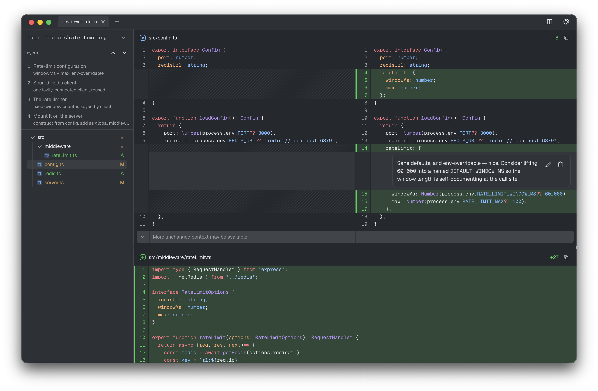

# Reviewer

Local-first macOS app for reading agent-authored code reviews.

Point any coding agent at your review rules; it writes a `.reviewer.json`. The `rvw` CLI shapes its
findings into an **overview**, line-anchored comments, and ordered **layers**, and validates every
anchor against the real diff so a hallucinated line can't reach you. Open it in Reviewer as a
guided walkthrough.

> **Note:** this project was developed entirely by Claude, no one has ever looked at its code.



## Features

- **Any agent, your rules.** `rvw` is a small, provider-agnostic CLI — no vendor lock-in. It hands
  the agent the artifact shape (`rvw schema`), real line numbers (`rvw anchors`), and coverage
  (`rvw coverage`). A human can drive it too.
- **Validated, not trusted.** `rvw emit` writes nothing unless every comment and layer range places
  against the diff.
- **Starts with a tour, not a file list.** A review opens on its **overview**: what the change
  does, then the walkthrough — one card per layer, with its files, line counts and a code preview,
  derived from the artifact so it can't go stale. Click a chapter to read its diff; come back any
  time.
- **A reading path.** Reviews are ordered *layers*, each with a `description`. Read
  in sequence or solo one.
- **Survives drift.** A comment whose code moved is flagged **Outdated**, never shown on the wrong
  line.
- **High-fidelity diffs** via Pierre's `@pierre/diffs` / `@pierre/trees`. Local-first — no account,
  no server.

## Usage

```bash
# 1. Author (agent writes draft.json of comments + layers; see `rvw schema`)
rvw emit --repo /path/to/repo --base main --head feature/foo --draft draft.json
rvw check <name>.reviewer.json      # validate + coverage

# 2. Read
rvw open <name>.reviewer.json       # or File → Open, or drag onto the window
```

With Claude Code, point the agent at the bundled skill (`rvw skills`). The artifact is refs-only —
the app re-derives the diff from your branch on open, so it stays small and current.

## Install

macOS. Grab the `.dmg` from the [latest release](../../releases/latest), or build from source:

```bash
bun install
bun run build:mac    # → Reviewer.app + .dmg in dist/
bun run build:cli    # → rvw CLI at dist/rvw.js
```

Release builds are unsigned — on first launch, right-click → **Open**, or:
`xattr -dr com.apple.quarantine /Applications/Reviewer.app`

## Develop

```bash
bun run dev     # electron-vite dev (HMR)
bun run check   # typecheck + lint + format
bun run test    # vitest
```

**Stack:** Electron, React 19, TypeScript, Tailwind v4, Base UI, zustand, zod, Pierre
`@pierre/diffs` / `@pierre/trees`, system `git`; [bun](https://bun.sh).

## License

MIT — see [LICENSE](./LICENSE).
