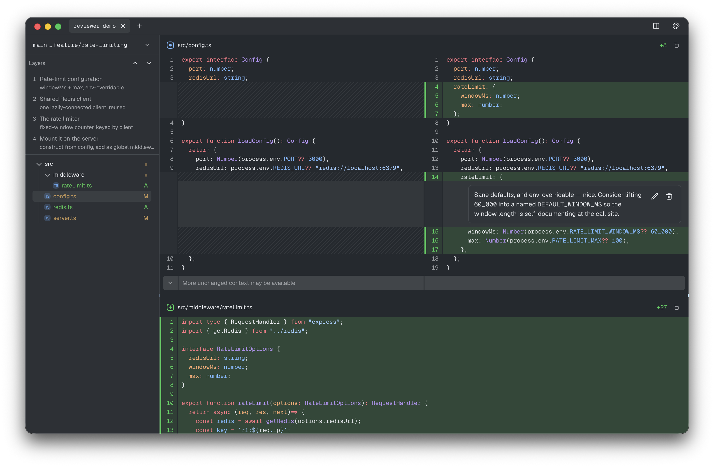

# Reviewer

Reviewer is a macOS app that shows the code review your agent wrote as a walkthrough of the diff, not as text in a terminal.



Your agent can already review code. You have a review skill, rules in `CLAUDE.md` or `AGENTS.md`, and a prompt you trust. The result is still a wall of text in a terminal, and you rebuild the diff in your head to follow it.

Reviewer keeps your agent and your prompt. It changes only where you read the review. You get:

- A summary of what the change does and why.
- The diff split into chapters that you read in order. The schema comes before the code that uses it, and the fix comes before its tests.
- Each finding on the lines it is about. `rvw`, the CLI that comes with the app, checks every finding against the real diff before it saves the review, so a comment cannot point at the wrong code.
- A mark for each finding (addressed, skipped, or disagree), and a button that copies the open findings back to your agent as a fix prompt.

`rvw` has no opinion about what a bug is, and it never tells your agent what to look for. A review is a file on your disk. There is no account and no server.

## Use it

Ask for the review the way you already do, and add one clause that says where the findings go:

```
/code-review this branch against main, then present the findings using the rvw CLI.
```

`/code-review` is Claude Code's built-in review skill. Replace it with your own. Any agent that can run a shell command works.

`rvw` ships with a skill that teaches the agent the review format and how to build the walkthrough, so none of that goes in your prompt. `rvw` works out the commit range, writes the review to `~/.rvw/reviews/`, and opens the app.

The start screen lists your recent reviews. **File ▸ Recent Reviews** (⇧⌘R) searches all of them.

A review stores git refs, not a copy of the diff, so it opens only on a machine that has the repository. To send a review to a machine without the repository, run `rvw emit --embed-patch`, which packs the diff into the file. Run `rvw --help` for the other commands.

To read a diff that has no review, choose **File ▸ Open Repository…** (⌘O). Pick a branch, a ref to compare it to, or a range of commits.

**Settings** (⌘,) has the theme, the code font, and the editor that files open in.

## Review someone else's pull request

Choose **File ▸ Review Pull Request…** (⇧⌘P) and paste the pull request's address. Reviewer finds your checkout of that repository, fetches the pull request with your own git credentials, and puts it in a separate worktree, so your branch and your uncommitted work are not touched. It then copies a prompt for your agent: review in that worktree, then present the findings with `rvw`. The prompt is editable in Settings. If you add your GitHub username in Settings, the dialog also lists the open pull requests that request your review, from public repositories. Remove a worktree from the same dialog when you are done.

`rvw emit --pr` records which pull request a review is of. It takes the URL, `owner/repo#123`, or a number. For a pull request, the agent also writes each finding the way it would be posted to the author, and the card shows that text under **For the author**. **Copy** puts it on the clipboard. **Copy & open on GitHub** also opens the pull request's changed files at the comment's lines, where you paste it.

You can also let Reviewer post the comments you pick as **pending** review comments, which only you can see. Paste a fine-grained token (Pull requests: read and write, on the repositories you choose) in **Settings ▸ GitHub**. Reviewer never submits a review: you read the drafts on GitHub and submit them yourself. The token stays in memory until you quit, because the app is unsigned, and `rvw` never sees it.

## Install

Reviewer runs on macOS. Download the `.dmg` from the [latest release](../../releases/latest).

The build is unsigned, so macOS blocks the first launch. Right-click the app and choose **Open**, or run:

```bash
xattr -dr com.apple.quarantine /Applications/Reviewer.app
```

The app then offers to install the `rvw` command.

### Install only the CLI on Linux

There is no Linux app. `rvw` runs on any machine with Node 20 or later, so you can write and check reviews on Linux and open them on a Mac.

```bash
curl -fsSL https://raw.githubusercontent.com/alxnddr/reviewer/main/scripts/install-cli.sh | sh
```

The script installs `rvw` to `~/.local/bin` for the current user. It also takes `--version 0.5.0` to install one release, and `--uninstall`. On Linux, pass `--no-open` to `rvw emit`, because opening a review needs the macOS app.

## Develop

```bash
bun install
bun run dev        # the app with hot reload
bun run check      # typecheck, lint, and format
bun run test       # vitest
bun run build:mac  # Reviewer.app and a .dmg in dist/
```

If you edit `cli/` while `bun run dev` is running, run `bun run build:cli` again. To return the app to a first launch, quit it and run `bun run reset`. `CLAUDE.md` describes how the code is organized.

## License

MIT. See [LICENSE](./LICENSE).

Claude wrote every line of this repository. No human has read the code.
